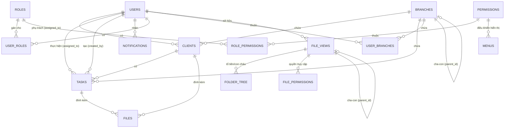

# Hệ Thống Quản Lý Dữ Liệu (Data Model) - Backend Rust

Tài liệu này mô tả chi tiết cấu trúc cơ sở dữ liệu và các model nghiệp vụ của hệ thống. Hệ thống sử dụng PostgreSQL làm cơ sở dữ liệu chính, được thiết kế theo hướng module hóa với các tính năng nâng cao như RBAC động, Multi-branch, và File System quản lý theo cây.

---

## 1. Sơ Đồ Quan Hệ Thực Thể (ER Diagram)

Dưới đây là mô hình quan hệ giữa các thành phần cốt lõi của hệ thống:

---

## 2. Các Thực Thể Cốt Lõi (Core Entities)

### 2.1 Users (Người dùng)
Lưu trữ thông tin tài khoản và định danh cơ bản.
- **Bảng**: `users`
- **Trường**:
  - `id`: UUID (PK)
  - `email`: TEXT (Unique, Index)
  - `password_hash`: TEXT
  - `full_name`: TEXT
  - `role`: TEXT (Liên kết logic với `roles.slug`)
  - `is_active`: BOOLEAN
  - `status`: TEXT
  - `created_at`, `updated_at`: TIMESTAMPTZ

### 2.2 Clients (Khách hàng)
- **Bảng**: `clients`
- **Quan hệ**: 
  - `assigned_to` (FK -> `users.id`): Người phụ trách trực tiếp.
  - `branch_id` (FK -> `branches.id`): Thuộc phân vùng chi nhánh nào.
- **Trường**: `id` (PK), `name`, `email`, `phone`, `company`, `position`, `status`, `notes`.

### 2.3 Tasks (Công việc)
- **Bảng**: `tasks`
- **Quan hệ**:
  - `assigned_to` (FK -> `users.id`): Người thực hiện.
  - `client_id` (FK -> `clients.id`, ON DELETE CASCADE): Công việc của khách hàng nào.
  - `created_by` (FK -> `users.id`): Người tạo task.
  - `branch_id` (FK -> `branches.id`): Thuộc chi nhánh nào.
- **Trường**: `id` (PK), `title`, `description`, `status`, `priority`, `due_date`, `completed_at`.

---

## 3. Phân Quyền & Truy Cập (RBAC & Scoping)

### 3.1 Dynamic RBAC (M:N Relationship)
- **Bảng `roles`**: `id` (PK), `slug` (Unique), `description`.
- **Bảng `permissions`**: `code` (PK), `description`.
- **Bảng `role_permissions`**: 
    - `role_id` (FK -> `roles.id`)
    - `permission_code` (FK -> `permissions.code`)
    - *Mô tả*: Một vai trò có nhiều quyền và một quyền có thể thuộc nhiều vai trò.
- **Bảng `user_roles`**:
    - `user_id` (FK -> `users.id`)
    - `role_id` (FK -> `roles.id`)
    - *Mô tả*: Một người dùng có thể đảm nhận nhiều vai trò (Admin + Manager).

### 3.2 Multi-branch (Hierarchical & M:N)
- **Bảng `branches`**:
    - `id` (PK), `parent_id` (FK -> `branches.id`): Cấu trúc cây chi nhánh.
- **Bảng `user_branches`**:
    - `user_id` (FK -> `users.id`)
    - `branch_id` (FK -> `branches.id`)
    - *Mô tả*: Một user có thể làm việc trên nhiều chi nhánh.

### 3.3 Resource Grants (Ad-hoc Access)
- **Bảng**: `resource_grants`
- **Trường**: `user_id` (FK), `resource_kind` ('client'/'task'), `resource_id` (UUID).
- *Mô tả*: Cấp quyền "ngoại lệ" cho một user truy cập vào một record cụ thể mà họ không sở hữu hoặc không cùng chi nhánh.

---

## 4. Quản Lý Tệp Tin (Virtual File System)

### 4.1 File Views & Hierarchy
- **Bảng `file_views`**:
    - `id` (PK), `parent_id` (FK -> `file_views.id`): Quan hệ cha-con.
    - `owner_id` (FK -> `users.id`): Người sở hữu.
- **Bảng `folder_tree` (Closure Table)**:
    - `ancestor_id` (FK -> `file_views.id`)
    - `descendant_id` (FK -> `file_views.id`)
    - *Mô tả*: Lưu mọi cặp tổ tiên-con cháu để truy vấn đệ quy không giới hạn cấp độ với hiệu năng cao.

### 4.2 File Permissions
- **Bảng `file_permissions`**:
    - `file_id` (FK -> `file_views.id`)
    - `subject_id` (FK -> `users.id` hoặc Group ID)
    - *Quyền*: `read`, `write`, `delete`, `share`, `admin`.

---

## 5. Quản Trị & Hạ Tầng

### 5.1 Dynamic Menus
- **Bảng `menus`**:
    - `key` (PK), `parent_key` (FK -> `menus.key`).
    - `required_permission` (FK -> `permissions.code`): Chỉ hiển thị menu nếu user có quyền này.

### 5.2 Event Store (CQRS)
- **Bảng `event_store`**:
    - `aggregate_id`: ID của thực thể (User/Client/Task).
    - `version`: Số phiên bản của thực thể tại thời điểm đó.
    - *Quan hệ*: Ghi lại mọi biến động dữ liệu của tất cả các bảng chính.

---

## 6. Tổng Kết Các Loại Quan Hệ
1.  **1:N (Một - Nhiều)**: User -> Clients, User -> Tasks, Branch -> Clients, File (Folder) -> Files.
2.  **M:N (Nhiều - Nhiều)**: User <-> Roles, Role <-> Permissions, User <-> Branches.
3.  **Self-Referencing (Đệ quy)**: Branches (Parent/Child), FileViews (Parent/Child), Menus (Parent/Child).
4.  **Polymorphic (Đa hình)**: 
    - `resource_grants` liên kết tới nhiều loại bảng (`clients`, `tasks`) qua `resource_kind` và `resource_id`.
    - `activities` liên kết tới bất kỳ thực thể nào qua `entity_type` và `entity_id`.

